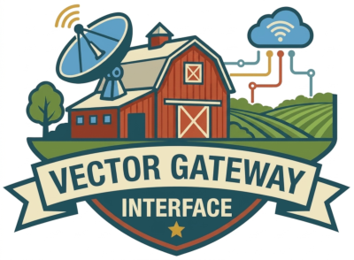

# Cupola

<p align="center">
  <a href="https://cupola.query-farm.services">
    
  </a>
</p>

A standalone web frontend for browsing VGI (Vector Gateway Interface) database catalogs. Cupola connects to any VGI HTTP server and presents its schemas, tables, views, and functions in a navigable catalog browser — with an embedded SQL shell, pivot tables, and an AI data analysis agent built in.

Designed to be shared across all VGI server implementations (Python, TypeScript, Go). VGI servers redirect browsers to the hosted frontend with `?service={url}`.

## Features

- **Catalog browser** — sidebar tree of schemas, tables, views, functions, and macros with searchable navigation, detail panels, column statistics, and on-demand column profiling
- **Embedded SQL shell** — DuckDB-WASM running in the browser with the VGI extension, an xterm.js terminal, tab completion, session persistence, and dot commands
- **AI data analysis** — Claude-powered agent that can run SQL, inspect schemas, and answer questions about your data (bring your own Anthropic API key)
- **AI file attachments** — attach, paste, or drag files into Ask AI, the SQL editor assistant, notebook assistant, report assistant, and terminal AI mode. Supports PNG/JPEG/GIF/WebP, PDF, text/code/data files, and Excel/ODS workbooks. Files are prepared locally and sent to Claude with your message; they remain in the in-memory conversation, and are not imported into DuckDB or saved with reports/notebooks. Up to 10 files per message, 10 MB per file (5 MB for images), and 20 MB combined. Text extraction is limited to 200,000 characters per file and workbooks to 10,000 rows per sheet; larger files must be split. PDF page/context limits also depend on the selected model. Terminal files attach to the next request in `.ai` mode. Attachment payloads are omitted from AI telemetry.
- **Pivot tables** — Perspective-based data grids backed directly by DuckDB-WASM
- **Data preview** — paginated table browsing, geometry (WKB) visualization, example queries, and Markdown descriptions via VGI tags
- **Deep linking** — selection state encoded in the URL hash so views can be shared
- **OAuth / PKCE** — works with VGI servers that require authentication, including per-catalog identity
- **Theming** — custom color themes loadable via `?theme=<url>`, with a live editor at `/theme-builder`

## Stack

- [Astro](https://astro.build) + [React](https://react.dev) — static site with React islands
- [ShadCN/UI](https://ui.shadcn.com) + [Tailwind CSS](https://tailwindcss.com) — components and styling
- [DuckDB-WASM](https://duckdb.org/docs/api/wasm/overview.html) — in-browser SQL engine
- [Perspective](https://perspective.finos.org) — pivot tables and data grids
- [xterm.js](https://xtermjs.org) — terminal emulator for the SQL shell
- [Bun](https://bun.sh) — package manager and runtime
- Hosted on a Cloudflare Worker with versioned assets served from R2

## Getting Started

```sh
# Install dependencies
bun install

# Start the dev server at http://localhost:4321
bun run dev
```

Cupola needs a running VGI server to talk to. Point it at one with the `service` query parameter:

```
http://localhost:4321/?service=http://localhost:9003
```

Without `?service=`, a welcome / connect page is shown.

## Commands

| Command           | Action                                       |
| :---------------- | :------------------------------------------- |
| `bun install`     | Install dependencies                         |
| `bun run dev`     | Start local dev server at `localhost:4321`   |
| `bun run build`   | Build the production site to `./dist/`       |
| `bun run preview` | Preview the production build locally         |
| `bun run test`    | Run unit tests                               |
| `bun run test:e2e:smoke` | Run the Chromium CI smoke suite against `VGI_SERVICE_URL` |
| `bun run check`   | Type-check Astro, React, and test sources    |
| `bun run check:bundle` | Enforce the production JS size budget after a build |
| `bun run audit`   | Report production dependency advisories     |
| `bun run image:build` | Build the self-hosted Caddy image as `cupola:flat` |
| `bun run image:test` | Smoke-test the locally built container image |
| `./publish.sh`    | Publish a new version (build, upload to R2, deploy) |

## URL Parameters

| Parameter | Purpose |
|-----------|---------|
| `?service=<url>` | VGI server base URL to connect to |
| `?attach_options=<sql>` | Extra options spliced into the DuckDB `ATTACH` statement |
| `?vgi_version=latest` | Use the community repository's current VGI extension for this tab session (omit the `VERSION` clause) |
| `?vgi_version=<version>` | Pin an exact VGI extension build for this tab session; use `default` to clear the override |
| `?theme=<url>` | URL of a theme JSON file (colors, logo, terminal theme) |
| `?fresh` | Clear any saved DuckDB session snapshot for this service |
| `#ai_key=<key>` | Anthropic API key for the AI agent (stripped from the URL after use) |
| `#/schema/<s>/table/<t>` | Deep link to a catalog selection |

## Deployment

The public Worker serves the current app at stable document URLs. `/latest/` and
historical `/v{version}/` page URLs redirect to those addresses; JavaScript, WASM,
and other assets stay under immutable `/v{version}/...` paths. Self-hosted builds
keep their configured base and do not check the public release service.

Publishing reserves a fresh version, uploads assets, verifies every uploaded file's
size, deploys the backward-compatible Worker, and promotes `_latest` last using a
conditional write. Never reuse a version after a partial upload; bump it and retry.
A local publish does not push a tag (which would start a duplicate CI deployment).
Do not run local publishing/rollback while CI publishing or cleanup is active.

`/release.json` is uncached. Hosted tabs check it every five minutes and when
returning to the tab; updates require an explicit reload. Existing tabs from before
this feature need one navigation/reload before they can display update notices.

Rollback: `./scripts/releases.sh rollback <version>` switches the current frontend
to a retained release; it does not roll back Worker code or browser data. Keep
Worker routing and saved-data formats compatible with retained frontends.

Retention: `./scripts/releases.sh cleanup` reports candidates; `--delete` applies
the plan. Keep all releases for 30 days, the current release, and two recent
rollback candidates. Activation refreshes a release's retention lease. Incomplete
uploads also expire after 30 days. Root-level legacy files are not deleted.
The daily Release retention workflow shares CI's production lock and defaults to
dry-run. Set the production environment variable `CUPOLA_CLEANUP_DELETE=true`
after reviewing its report to enable deletion. Very old tabs may need a reload
once their assets expire; historical hosted versions are not a supported product.

**Publish locally:**

1. Bump `version` in `package.json`
2. Run `./publish.sh`

Pull requests and pushes to `main` run the **CI** workflow (`.github/workflows/ci.yml`): frozen installs, type checking, unit tests, a production build, bundle-size enforcement, and Chromium smoke tests against the hosted Open-Meteo VGI service. Dependency advisories are reported there without failing the build until the existing audit backlog is resolved.

### Releases

Releases are tag-driven. Update `package.json` to the next unused version,
commit it, then push the matching tag:

```sh
git tag v0.4.116
git push origin v0.4.116
```

The **Release** workflow requires the tag to exactly match `package.json`. It
then runs the complete validation suite, publishes a multi-platform image to
GHCR, deploys the versioned Cloudflare/R2 site in a separate job, and creates a
GitHub Release with generated notes after both publishing jobs succeed.

Required repository secrets:

| Secret | Purpose |
|--------|---------|
| `SENTRY_AUTH_TOKEN` | Sentry source-map upload |
| `CLOUDFLARE_API_TOKEN` | Worker deploy |
| `R2_ACCESS_KEY_ID` / `R2_SECRET_ACCESS_KEY` | R2 S3-API asset upload |

The GitHub-provided token publishes the container; no registry password is
required. The GHCR package must be made public once in the repository/package
settings so unauthenticated users can pull it.

### Self-hosting with Docker

Release images support both `linux/amd64` and `linux/arm64`:

```sh
docker run --rm -p 8080:80 ghcr.io/query-farm/cupola:latest
```

Open `http://localhost:8080/?service=https://your-vgi-server.example`. Exact
release and minor-line tags are also published, for example `0.4.116` and
`0.4`. The image is a static Caddy server and does not embed a VGI endpoint;
the `service` URL remains runtime-configurable.

To build locally, run `bun run image:build`, followed by
`bun run image:test`. All VGI client dependencies are installed from npm; no
sibling repository checkout is required.

## License

Licensed under the [Apache License 2.0](LICENSE).

Copyright © 2026 Query Farm LLC — [https://query.farm](https://query.farm)
